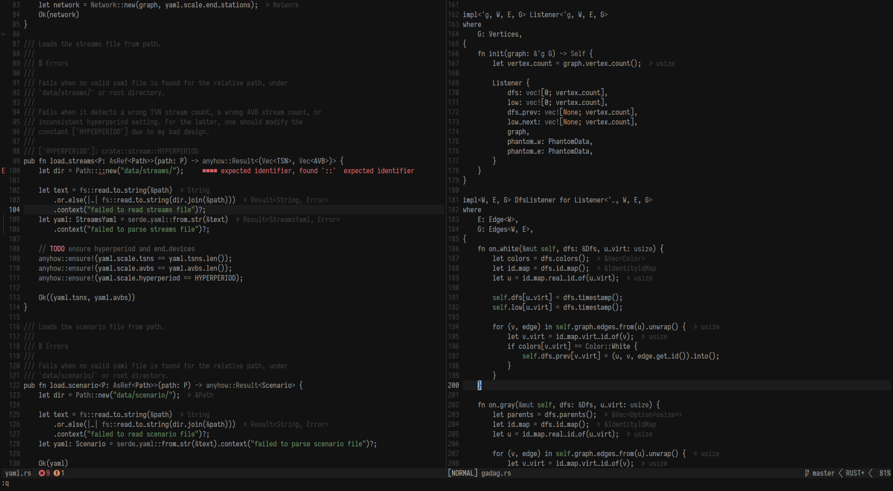
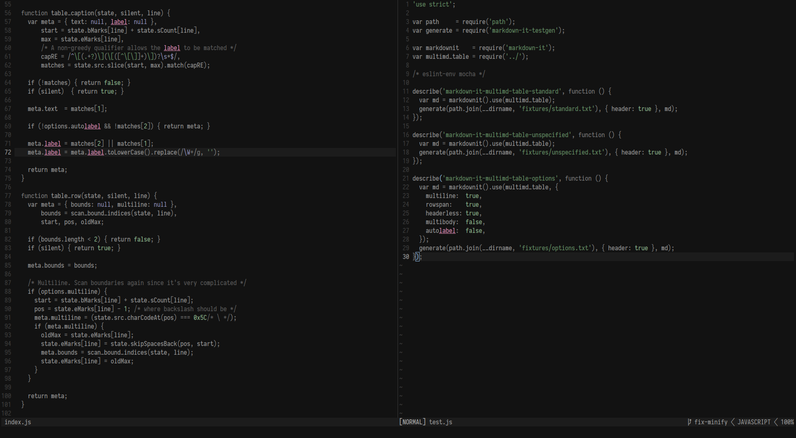

# Cactusbuddy

A plain succulent 256-color theme using [colorbuddy].

[colorbuddy]: https://github.com/tjdevries/colorbuddy.nvim

## Screenshots

### Rust



### JavaScript



## Installation

```vim
" Using vim-plug
Plug 'tjdevries/colorbuddy.vim'
Plug 'tobshub/tsoding-buddy'
lua require('colorbuddy').colorscheme('tsoding-buddy')
```

```lua
-- Using packer
use { 'tobshub/tsoding-buddy', requires = 'tjdevries/colorbuddy.vim' }
require('colorbuddy').colorscheme('tsoding-buddy')
```

## Use with [express_line]

[express_line]: https://github.com/tjdevries/express_line.nvim

Enable the statusline settings in screenshots.

```lua
use { 'tjdevries/express_line.nvim', requires = 'nvim-lua/plenary.nvim' }
vim.g.cactusbuddy_express_line_enabled = true
require('colorbuddy').colorscheme('tsoding-buddy')
```
